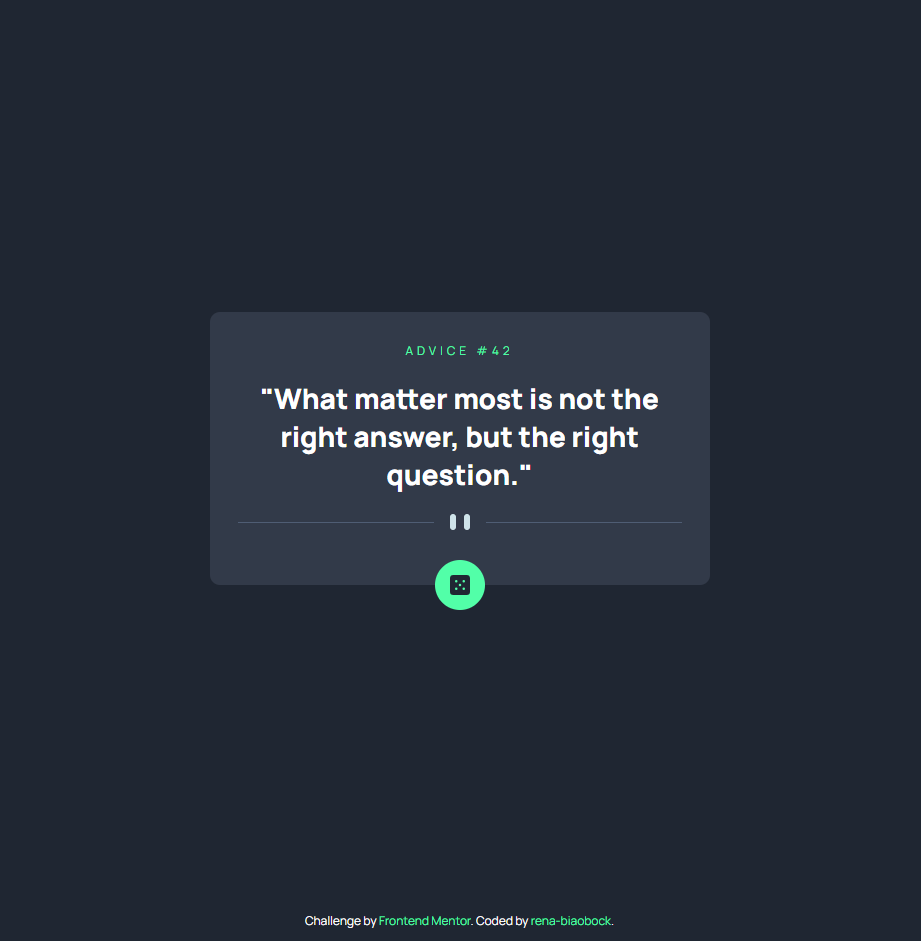

# Frontend Mentor - Advice generator app solution

This is a solution to the [Advice generator app challenge on Frontend Mentor](https://www.frontendmentor.io/challenges/advice-generator-app-QdUG-13db). Frontend Mentor challenges help you improve your coding skills by building realistic projects.

## Table of contents

- [Overview](#overview)
  - [The challenge](#the-challenge)
  - [Screenshot](#screenshot)
  - [Links](#links)
- [My process](#my-process)
  - [Built with](#built-with)
  - [What I learned](#what-i-learned)
  - [Continued development](#continued-development)

## Overview

### The challenge

Users should be able to:

- View the optimal layout for the app depending on their device's screen size
- See hover states for all interactive elements on the page
<!-- - Generate a new piece of advice by clicking the dice icon -->

### Screenshot

### Links

- Solution URL: [GitHub repository](https://github.com/rena-biaobock/advice-generator-app)
- Live Site URL: [GitHub Page](https://rena-biaobock.github.io/advice-generator-app/)

## My process

### Built with

- HTML5
- CSS3
- Flexbox

### What I learned

- Mobile responsiveness
- Flex position
- Transformations

### Continued development

Add functionality to play button with javascript